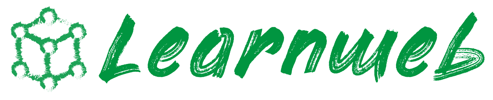

# Learnweb - Collaborative learning environment with extended search and sharing functions

Learnweb is a collaborative search and sharing system which brings together different online services such as
YouTube, Flickr, Google Search, Vimeo and SlideShare under one umbrella. It also provides advanced features for organizing and
sharing distributed resources with a group of people.

## History

The history of this project starts in 2009 with the work of Dr. Sergej Zerr and his students at the L3S Research Center.
Since that time, the system was continuously developed and improved by many students and researchers, to meet the needs
of all user groups – teachers, learners, researchers.

LearnWeb has been adapted to learning scenarios such as the YELL/TELL community and research projects such as EU-MADE4LL.
YELL/TELL stands for Young English Language Learners/Teen English Language Learners and is a virtual meeting place for
foreign language teachers, language students and university lecturers who can seek, share, evaluate and adapt resources
to professional practice. The EU-MADE4LL project (European Multimodal and Digital Education for Language Learning)
promotes the modernisation of higher education and the employability of graduates.

## License

This project is licensed under the MIT License - see the [LICENSE](LICENSE) file for details.
